# Sistema de Gerenciamento de um Site de Vendas de Artigos Esportivos

A empresa SportsZone, especializada na venda de artigos esportivos, enfrenta um aumento significativo em sua clientela e deseja implementar um sistema de gerenciamento abrangente para melhorar sua eficiência operacional e atender às necessidades crescentes dos clientes. Este sistema incluirá entidades, atributos e relacionamentos necessários para gerenciar produtos, clientes, pedidos, fornecedores e funcionários.

# CENARIOS

 # 🚀 Entidades: 
## Produto:  
  ### Atributos:
	ID do Produto (atributo chave)
	Nome
	Descrição
	Preço
	Marca
	Categoria 
  ### Relacionamento:
 	Cada produto pode ser fornecido por um ou vários fornecedores (N:N).
 	Cada pedido inclui um ou muitos produtos (0:N).
## Cliente:
 ### Atributos:
	ID de Cliente (atributo chave)
	Nome
	Endereço (Composto)
	(
	Cep
	Cidade
	Estado
	Rua
	)
	E-mail (multivalorado)
	Número de Telefone (multivalorado)
### Relacionamento:
 	Cada cliente fez zero ou muitos pedidos (1:N).
## Pedido:
  ### Atributos:
	Número de Pedido (atributo chave)
	Data do Pedido
	Status do Pedido
	Valor Total (Derivado)
 ### Relacionamento:
 	Cada pedido é feito por um único cliente (1:1).
 	Cada pedido inclui um ou muitos produtos (1:N).
	Cada pedido é feito por um funcionario (1:1).
	
 ## Fornecedor:
  ### Atributos:
	ID de Fornecedor (atributo chave)
	Nome da Empresa
	E-mail (multivalorado)
	Número de Telefone (multivalorado)
 ### Relacionamento:
 	Cada fornecedor fornece um ou muitos produtos (N:N).

## Funcionário:
  ### Atributos:
	ID de Funcionário (atributo chave)
	Nome
	Cargo
	Data de Contratação
 ### Relacionamento:
 	Cada funcionário faz um único pedido por vez (1:1).

# 🤖 Atributos:

## Atributos Simples: 
Id_prod, Nome, Descrição, Preço, Marca, Categoria  
Id_forn, Endereço, Nome da Empresa.  
Num_pedido, Data do Pedido, Status do Pedido, Valor Total.  
Id_func, Cargo, Data de Contratação, Salário.  
Id_cliente, Nome do Cliente.
## Atributos Compostos: 
Endereço do Cliente (dividido em rua, cidade, estado e CEP).
## Atributos Multivalorados: 
Número de Telefone (um cliente ou fornecedor pode ter vários números de telefone).  
E-mail (um cliente ou fornecedor pode ter vários e-mails).
## Atributos Derivados: 
Valor Total do Pedido (calculado com base no preço e quantidade dos produtos em um pedido).
## Atributos Chave: 
id_prod (para produtos).  
id_cliente (para clientes).  
num_pedido (para pedidos).  
id_forn (para fornecedores).  
id_func (para funcionários).

# 👾 Relacionamentos:

## 1:1: 
Funcionario e Pedido
## 1:N: 
Pedido e Produto  
Pedido e Cliente
## N:N: 
Fornecedor e Produto

<h1>Modelagem Conceitual: </h1>
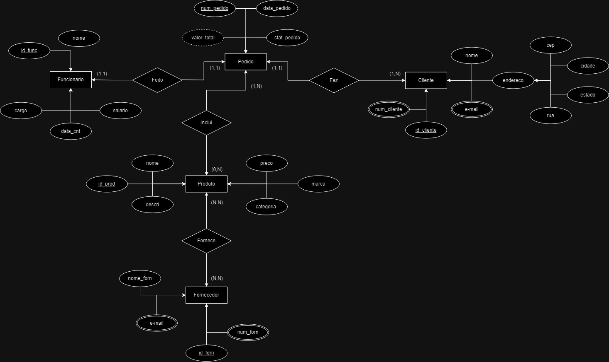
<h1>Modelagem Logica</h1>

# Modelagem fisica

Foi usado Microssoft SQL Server Management Studio.

# Dados

# Tabela funcionarios

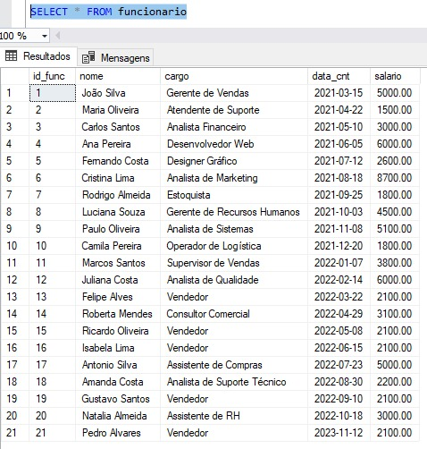

# Tabela cliente

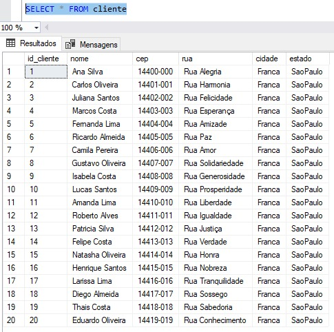

## e-mail cliente

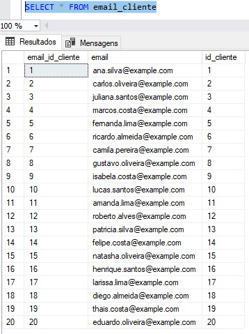

## telefone cliente

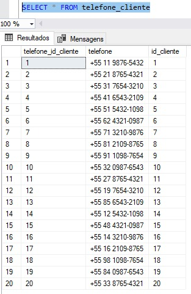

# Tabela Fornecedor

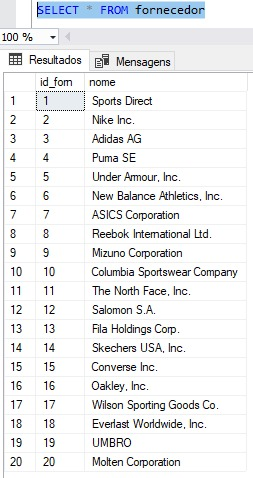

## Telefone fornecedor

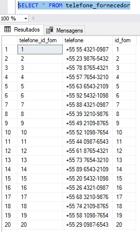

## e-mail fornecedor

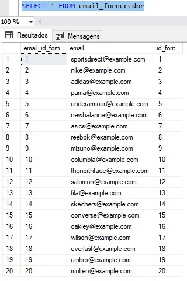

# Tabela pedido

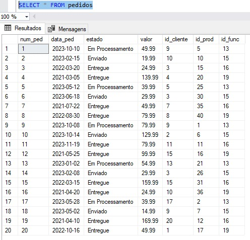

# Tabela Produto

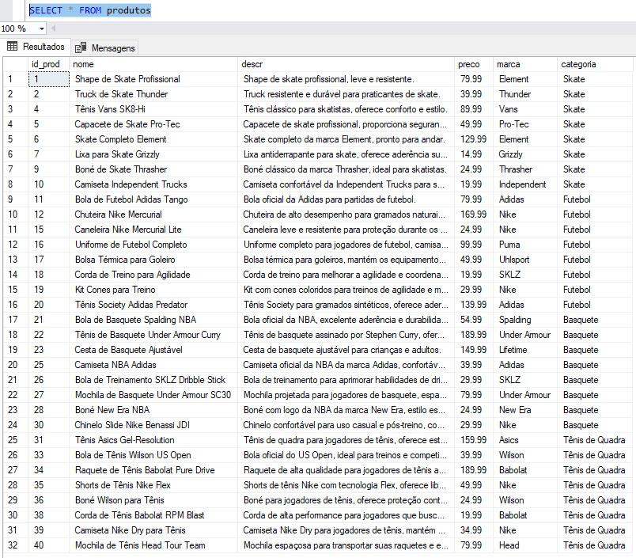

# Relatorios

### 1
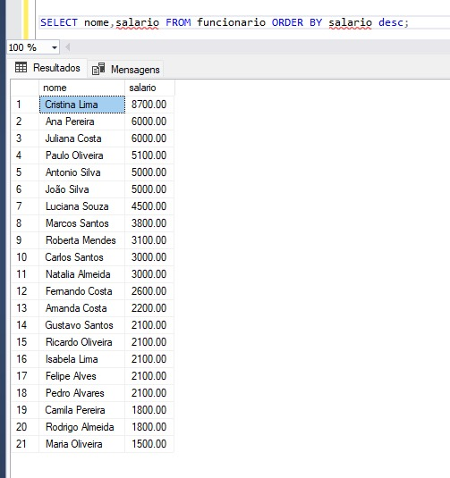

### 2
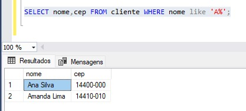

### 3
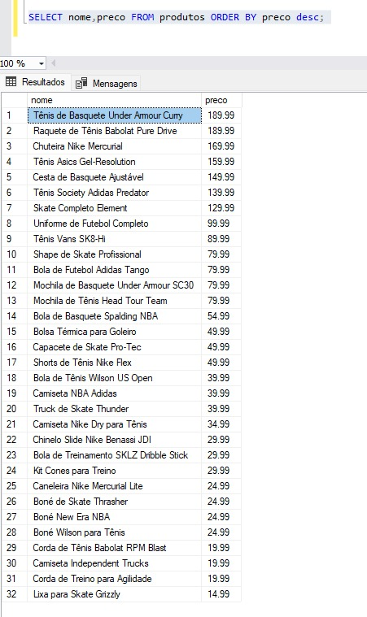

### 4
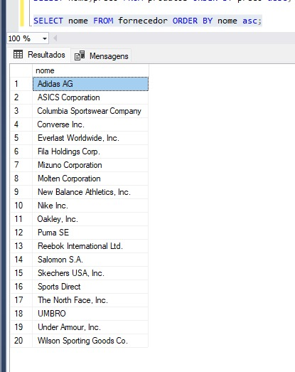

### 5
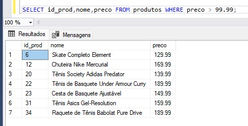

### 6
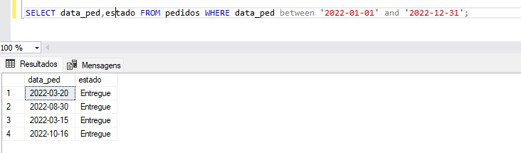

### 7
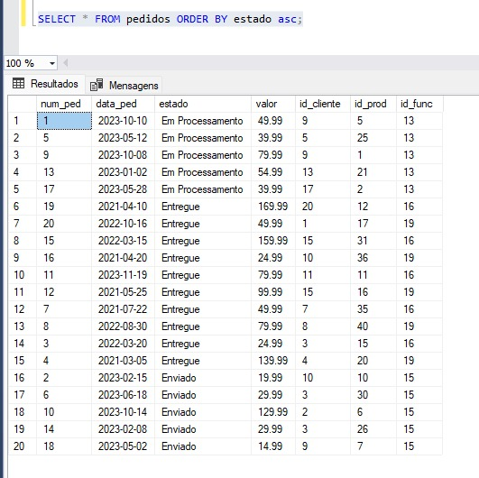

### 8
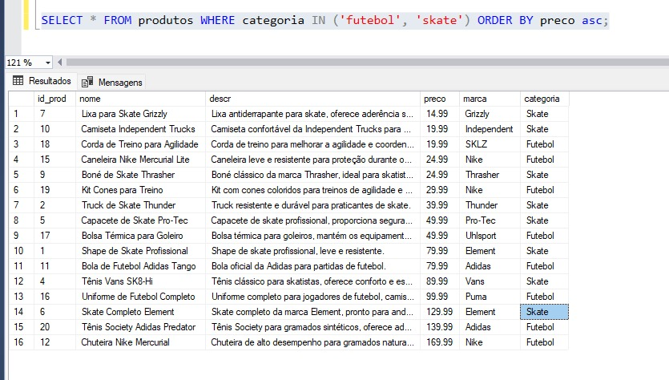

### 9
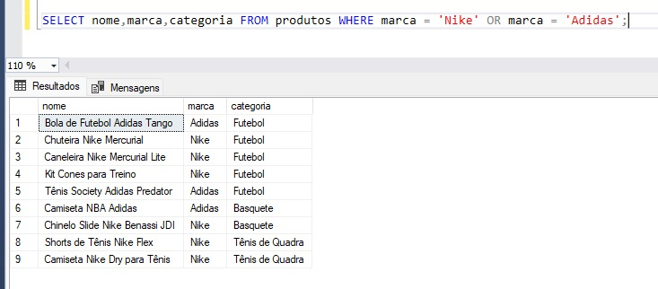

### 10
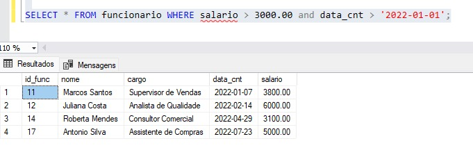

# Crud

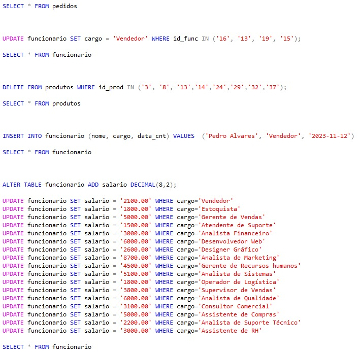

 

 

